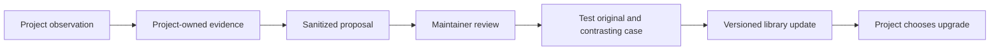

# Visual Design Kit


**A reusable design workflow for humans working with Codex.** The Claude Code route is documented but its fresh wrapper execution remains unverified. Research the brief, choose a direction, create the work, verify the output, and carry accepted decisions into the next step.

> **Current status: supervised evaluation. No tagged release exists yet.** Codex installation and project-level startup have been checked on the authoring Mac. The library contains 130 reference capabilities. The 0.2.0 candidate adds rendered fictional brand examples, revision and recovery checks, stronger validators and portable templates. Final edition-specific evidence is recorded below. This is usable for a supervised first project, not a claim that every tool or deliverable is production-tested.

Version-Timestamp: 2026-09-16T18:27:08.062526-04:00

[Installation record](INSTALLATION.md) · [Start a project](#start-a-project) · [What is included](#what-is-included) · [Readiness](#what-is-verified) · [AI instructions](#instructions-for-ai-agents) · [Full catalog](docs/CAPABILITIES.md) · [Remaining work](BACKLOG.md)

## What this is for

Visual Design Kit gives a designer and an AI agent a common process, vocabulary, and set of deliverable contracts. It helps turn an ambiguous request into a sequence of inspectable outputs. It supports an entire project, an individual phase, or a precise revision.

Examples include:

- Extending an existing brand into a website, campaign, retail screen, or touchscreen experience while preserving its approved identity.
- Developing a new brand from research and positioning through logo concepts, typography, color, visual language, and guidelines.
- Designing a website or app experience using audience evidence, journeys, flows, information architecture, prototypes, and a component inventory.
- Creating copy, infographics, presentations, sales collateral, static screen content, and motion content with an explicit message and design rationale.
- Revising an existing deliverable without accidentally changing approved text, product details, layout, or branding.

The kit supplies instructions, templates, reference methods, and selected validation tools. The AI and available production software execute the work. Installing the kit does not include a design app, provider subscription, media credits, client assets, or an unattended service.

## How the pieces fit together

| Piece | Meaning | Where it lives |
| --- | --- | --- |
| Kit | The versioned collection of reusable methods | This repository |
| Plugin | Codex packaging for the entry skill | `plugins/visual-design-studio/` |
| Starting skill | Reads the brief and selects relevant instructions | `skills/design-project-start/SKILL.md` inside the plugin |
| Capability | A focused design task with inputs, outputs and checks | The [130-entry catalog](docs/CAPABILITIES.md) |
| Agent | Codex or Claude Code following the selected instructions | Your separate project task |
| Project | One brand's assets, deliverables, decisions and memory | A separate folder or repo |

**Repository name:** `visual-design-kit`. **Plugin identifier:** `visual-design-studio`. **Marketplace identifier:** `visual-design-team`. The latter two are retained so the repository rename does not break the existing local installation.

Only the starting skill is placed in the plugin's discoverable skills directory. The 130 capability files remain reference material loaded as needed. They are not all registered commands or all loaded into every task.

## What is included

| Category | Main coverage | Entry reference |
| --- | --- | --- |
| Research and audience | Existing-brand audit, evidence, positioning, personas, source limitations | [Research](plugins/visual-design-studio/library/RESEARCH-CAPABILITIES.md) |
| Creative direction | Mood boards, distinct concepts, style vocabulary, rationale, visual language | [Creative direction](plugins/visual-design-studio/library/CREATIVE-DIRECTION.md) |
| Brand and identity | Naming, logo concepts/refinement/variants, refresh, guidelines, delivery | [Identity workflow](plugins/visual-design-studio/library/IDENTITY-WORKFLOW.md) |
| Design craft and taste | Hierarchy, composition, typography, color, critique and refinement | [Craft methods](plugins/visual-design-studio/library/DESIGN-CRAFT.md) |
| UX and UI | Personas, journeys, flows, architecture, prototypes and interface systems | [UX deliverables](plugins/visual-design-studio/library/UX-DELIVERABLES.md) |
| Websites | Discovery, content, responsive layout, implementation, SEO, accessibility, QA and release | [Website workflow](plugins/visual-design-studio/library/WEBSITE-WORKFLOW.md) |
| Displays | Screen content, adaptation, campaigns, playlists, product fidelity and finishing | [Display workflow](plugins/visual-design-studio/library/DISPLAY-WORKFLOW.md) |
| Touchscreens | Interaction states, product education, forms, offline behavior, session recovery and device tests | [Screen skills](plugins/visual-design-studio/library/SCREEN-CONTENT-SKILLS.md) |
| Motion and media | Storyboards, animation, kinetic type, loops, video, compositing and generation routes | [Media workflow](plugins/visual-design-studio/library/MEDIA-QUALITY-WORKFLOW.md) |
| Content | Brand voice, website and UX copy, campaign copy, decks and collateral | [Content workflow](plugins/visual-design-studio/library/CONTENT-WORKFLOW.md) |
| Infographics | Story structure, information hierarchy, layout and visual explanation | [Infographic skill](plugins/visual-design-studio/library/draft-skills/design-infographics/SKILL.md) |
| Production and delivery | Tool selection, editable masters, exports, fidelity checks and handoff | [Production](plugins/visual-design-studio/library/SOFTWARE-PRODUCTION.md) |

The JSON catalog `plugins/visual-design-studio/library/capabilities.json` is canonical; docs/CAPABILITIES.md is its generated human-readable view. The [complete catalog](docs/CAPABILITIES.md) lists every exact capability ID, instruction file, and declared dependency. A listed component or technique is inventory coverage, not proof that a reusable implementation or production-tested output already exists.

## The working sequence


This is a branching process, not a compulsory checklist. A typography correction should not trigger a new logo or a complete persona study. Existing approved inputs can satisfy earlier stages. Missing prerequisites must be resolved or explicitly treated as provisional before dependent work proceeds.

For an **existing brand**, identify the authoritative guidelines, locked assets, campaigns, tone, and permitted scope of change. If official assets are unavailable, distinguish public observations from official rules. Proposed extensions remain provisional until accepted.

For a **new brand**, establish the offer, audience, positioning, and naming status before identity concepts. Naming exploration does not establish trademark clearance. Move selected directions into a coherent visual system and then into the requested applications.

## Start a project

### 1. Get the private library

An authorized GitHub account is required. Clone the repo into a dedicated library directory:

```sh
git clone https://github.com/newmindsgroup/visual-design-kit.git
cd visual-design-kit
```

Choose a verified commit for the project and record it. A changing `main` branch is not a fixed project version. Formal release archives are still on the backlog.

### 2. Install the Codex plugin, if desired

From the clone root:

```sh
codex plugin marketplace add .
codex plugin add visual-design-studio@visual-design-team --json
codex plugin list --marketplace visual-design-team --json
```

Installation has been observed on Codex CLI 0.154.0 on the authoring Mac. Other machines must verify their own result. The plugin does not install or authenticate Figma, Adobe, OpenArt, or Higgsfield.

### 3. Create an independent brand project

Create a separate folder or repository for the brand and open the AI task there. Do not create client deliverables inside this library. For the two intended cases, use two different projects.

Merge the [project starter](project-starter/AGENTS.md.template) into that project's `AGENTS.md`, following its [instructions](project-starter/README.md). Preserve existing instructions. Replace the package-root placeholder with the absolute path to `plugins/visual-design-studio` inside your pinned checkout. Replace the digest placeholder with the trusted SHA-256 of that package's `PAYLOAD.sha256`.

To calculate the manifest digest locally on macOS:

```sh
shasum -a 256 plugins/visual-design-studio/PAYLOAD.sha256
```

The maintainer-verified package baseline is listed in [the pin record](docs/VERIFIED-PIN.md). The expected digest must come from the trusted version or maintainer. Calculating a digest from an unknown download does not make the download trustworthy. The startup entry compares the digest and verifies listed file bytes before following package instructions.

For Claude Code, the intended equivalent is the same entry in `CLAUDE.md`. Its fresh-project behavior remains unverified. The Codex manifest is not a native Claude plugin manifest.

The path in the project entry is authoritative for that project. The optional installed plugin cache may lag and must not silently replace it. Keep machine-specific absolute paths out of shared client commits; prepare each machine's entry locally. The checksum covers plugin payload files, not the repo-level startup template; the latter is pinned by the Git commit.

### 4. Give the project its brief

Use a request like this inside the separate brand project:

```text
Use this project's Visual Design Kit entry.
This is an existing brand / new brand.
Our first deliverable is [...].
Our audience and intended channel are [...].
The available assets and guidelines are at [...], or are not available yet.
Preserve these approved decisions: [...].
Ask for the information needed for the next step, select the relevant
capabilities, and produce the first reviewable deliverable.
Keep project data here and the shared library read-only.
```

You do not need to supply every possible detail at once. The agent should identify the information needed for the next dependency. It must not fill unknown facts with invented research or approvals.

### 5. Review actual outputs

Review the design and its rationale, not just the agent's report. Record what is approved, what needs revision, and what must remain unchanged. Final delivery should include the requested editable source, exports, usage notes, and unresolved limitations.

## Why an installed skill can be missing from the AI's list

Think of the global skills list as the table of contents Codex gives the AI at startup. On the authoring Mac, the installed catalog is very large. In our fresh-session check, Codex reported that **1,141 skills were left out of the model-visible list** after its context budget was exceeded. The plugin was installed and enabled, but the AI reported that it could not see its entry.

That does not mean the files were deleted. It means the AI was not shown those entries in that session. The observed warning is about skill metadata, not a statement that project files or saved memory disappeared.

The project starter avoids this dependency: `AGENTS.md` directs the agent to a known, pinned entry file. Separate fresh-session checks reached the correct library this way, including a checksum verification pass. Global automatic discovery is still unresolved. This workaround requires no removal of other skills or global context change. The omission count is specific to the observed machine and session.

## What is verified

| Area | Current evidence | Limit |
| --- | --- | --- |
| Package structure | Plugin and starting-skill validation pass | Does not prove output quality |
| Integrity | 322 payload hashes and archive byte comparison pass | Does not establish source trust by itself |
| Codex installation | Installed and enabled locally | Not all machines or versions |
| Explicit project startup | Fresh separate project reads entry and verifies payload | Read-only startup, not finished artwork |
| Capability selection | Existing-brand and new-brand selection exercises pass | Bounded scenarios |
| Catalog | 130 unique IDs, existing entry files and valid dependency references | Not 130 production executions |
| Bundled tests | 8 Python and 11 JavaScript tests pass | No hardware or human acceptance |
| Claude Code wrapper startup | Intended explicit-path route documented | Fresh wrapper execution pending |
| Automatic skill discovery | Failed under host catalog budget | Project startup workaround tested |
| Production quality | Several historical tool fixtures exist | New outputs still require inspection and approval |

**Known holds:** the local-model revision-fidelity and touchscreen-recovery tests failed; that route is not qualified for those tasks. Codex production/revision tests in independent projects remain pending, which is a separate status. The latest generated OpenArt motion remains visually unverified. Real screen/player, accessibility, and human acceptance belong to the actual implementation. PowerPoint and backup are explicitly deferred.

Older status text inside the preserved library is historical. This README, [installation record](INSTALLATION.md), and [backlog](BACKLOG.md) describe the wrapper's current progress. A release-status correction does not weaken a skill's safety, input, or quality requirements.

## Tool and output expectations

Use the tool that produces the required result and editable master. Figma desktop/MCP, Illustrator, Photoshop, and Canva have bounded fixture evidence in the original project. This does not establish every operation, font, asset type, or export on another machine. Separate Figma CLI, broader Adobe motion routes, and Higgsfield generation still have qualification gaps.

OpenArt, Higgsfield and built-in image generation are optional routes. Check authentication, permitted data, model parameters, available entitlement, and scoped credit allowance before generation. Never automatically repeat an uncertain submission.

Product and environment imagery should meet the agreed photographic standard and preserve product identity. Logos, diagrams, type and other vector work should use the appropriate medium. Typography should avoid isolated last words and awkward wrapping at the actual output sizes. Check hierarchy, contrast, readability, accessibility, and brand consistency on the rendered artifact.

## Project memory and feedback



Each project keeps `PROJECT.md`, `library-version.json`, `SELECTED-CAPABILITIES.json`, `DECISIONS.md`, and `RESUME.md`, plus the relevant deliverable templates. Use standard Markdown so Obsidian can navigate those files without creating a second competing copy. The kit is not a background memory service.

The [feedback contract](plugins/visual-design-studio/FEEDBACK.md) puts proposals under the project's `feedback/library-proposals/` directory. Remove client identifiers, private URLs, proprietary copy, assets, secrets, and personal data. No return destination is assumed. The project owner authorizes where a sanitized proposal goes.

A maintainer reviews overlap, improves an existing skill or creates a distinct reusable skill, tests the change, and versions the accepted result. Projects remain pinned until they deliberately adopt an update. This improves instructions and process; it does not retrain the underlying AI model.

## Instructions for AI agents

1. Read the adopting project's instructions first. For current wrapper release status, README.md, INSTALLATION.md and BACKLOG.md supersede historical readiness statements; they do not weaken capability constraints. Resolve entry conflicts explicitly.
2. Verify the trusted package pin and payload. Do not write inside the package.
3. Read `skills/design-project-start/SKILL.md` and its governing links.
4. Use exact IDs and entry paths from `library/capabilities.json`; do not guess IDs from directory names.
5. Load only relevant capabilities and required input contracts. Reuse accepted evidence rather than recreating it.
6. Keep assumptions, proposed decisions, approved baselines, actual files and failed checks distinct.
7. Verify destination tools and authority. Installation does not grant spending, uploads or release approval.
8. Inspect actual outputs. A valid JSON record or successful export does not prove good design.
9. Save a truthful project handoff and sanitized improvement proposals when useful.

## Repository map

```text
visual-design-kit/
  README.md                         Human and AI overview
  INSTALLATION.md                    Observed setup and limitations
  BACKLOG.md                         Remaining work
  docs/
    CAPABILITIES.md                  Every catalog ID and dependency
    images/                         Documentation artwork
  project-starter/                   Mergeable project startup instructions
  .agents/plugins/marketplace.json   Codex marketplace entry
  plugins/visual-design-studio/
    .codex-plugin/plugin.json        Plugin metadata
    skills/design-project-start/    One discoverable entry
    library/                        Reference skills, templates and checks
    PROJECT-LAUNCH.md                Independent project contract
    FEEDBACK.md                     Reviewed improvement process
    READINESS.md                    Edition scope and verification limits
    PAYLOAD.sha256                  File integrity manifest
```

This GitHub repository is the curated reusable snapshot. The original local research workspace and its history were not uploaded wholesale. The [backlog](BACKLOG.md) includes completing a repeatable, reviewed source-to-release update process. Private books, client sources, generated experiments, and provider receipts are excluded.

## What comes next

The [September 16 quality audit](docs/DESIGN-QUALITY-AUDIT-2026-09-16.md) identifies concrete reliability fixes and the next creative-quality work batches. It distinguishes existing methods from missing execution evidence. The pinned plugin has not been changed by the audit. Version-Timestamp: 2026-09-16 17:22:38 AST.

Finish artifact creation, revision, and resume tests in independent projects; verify Claude startup; test upgrades/removal and negative startup cases; reconcile preserved status text; complete release review and publish a versioned release. Then use the two actual brand projects with human review and return the useful lessons.

You can begin a **supervised project now through the pinned project starter**, starting with the brief and selected work. Do not interpret that as an assurance that every deliverable, provider, or device is already qualified. The [full backlog](BACKLOG.md) remains the completion checklist.

## Reproduce the bundled tests

From `plugins/visual-design-studio/library`:

```sh
python3 -m unittest discover -s tests -p test_screen_campaign.py
node --test examples/screen-production/player.test.mjs examples/media-quality-recipes/touch-session/session.test.mjs
```

Expected: 8 Python tests and 11 JavaScript tests. Check `git status --short` in the library checkout after project work to detect unexpected changes; the read-only instruction is an agent-followed rule, not filesystem enforcement. Only authorized team members may access this private repo. Do not copy the kit into client repositories or redistribute it without permission.

## Optional books and additional IDEs

See [portable reference-library requirements](resources/README.md) and [Codex, Cursor and Claude Code setup](docs/IDE-COMPATIBILITY.md). Full source books are not bundled. Transfer preparation and runtime acceptance remain explicit tasks; sharing a Drive folder does not establish source permissions or completeness.


## Quality edition 0.2.0

[What changed and what was tested](docs/QUALITY-020-RELEASE.md) · [Resume the work](RESUME.md) · [Implementation plan](docs/QUALITY-IMPLEMENTATION-020.md) · [Visual calibration collection](plugins/visual-design-studio/library/examples/quality-benchmark/README.md)

This edition strengthens the existing capabilities instead of adding another overlapping design agent. A shared set of fictional examples teaches the difference between technical correctness, distinctive craft and a polished design that violates the brief. It includes precise revisions, motion, PDF proofs and intentional failure controls. Human acceptance stays separate from automated checks.

Run the collection locally from the library directory with `python3 -m http.server 17672 --bind 127.0.0.1`, then open `http://127.0.0.1:17672/examples/quality-benchmark/`. This binds only to your computer. It does not publish client work.

Version 0.2.0 is now installed and hash-verified on the authoring Mac. Its independent review, 74 code tests, 20 browser cases and export checks are recorded in the edition evidence above. The source remains a supervised candidate on the review branch until deliberately merged; clone or pin the intended commit rather than assuming the default branch includes it. A real project still supplies its own brief, evidence and approval.
