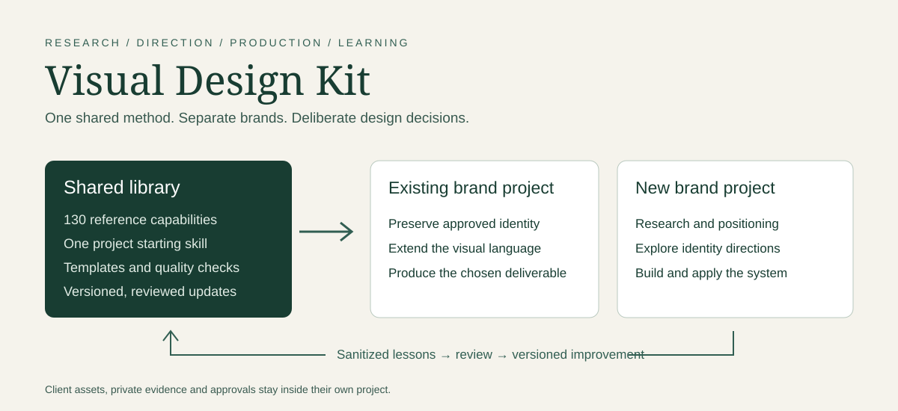
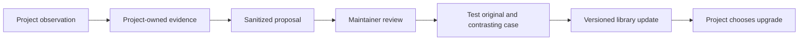

# Visual Design Kit



**A reusable design workflow for people working with AI coding assistants.** Research the brief, choose a direction, create the work, inspect the output, and carry accepted decisions into the next step. Codex has observed installation and startup evidence. Cursor and Claude Code use a documented project-entry route whose native-session acceptance remains unverified.

> **Current status: supervised evaluation.** The library contains 130 reference capabilities. Version 0.2.1 corrects public onboarding and package documentation. The [0.2.0 evidence](docs/QUALITY-020-RELEASE.md) covers the existing fictional examples, validators and bounded authoring-machine checks. A public repository or a matching checksum does not establish production readiness. Each project still needs human review and checks of its actual outputs.

Version-Timestamp: 2026-09-27 13:45:10 AST

[Installation](INSTALLATION.md) · [Start a project](#start-a-project) · [What is included](#what-is-included) · [Readiness](#what-is-verified) · [AI instructions](#instructions-for-ai-agents) · [Full catalog](docs/CAPABILITIES.md) · [Development checks](docs/DEVELOPMENT.md)

## What this is for

Visual Design Kit gives a designer and an AI agent a common process, vocabulary, and set of deliverable contracts. It helps turn an ambiguous request into a sequence of inspectable outputs. It supports an entire project, an individual phase, or a precise revision.

Examples include:

- Extending an existing brand into a website, campaign, retail screen, or touchscreen experience while preserving its approved identity.
- Developing a new brand from research and positioning through logo concepts, typography, color, visual language, and guidelines.
- Designing a website or app experience using audience evidence, journeys, flows, information architecture, prototypes, and a component inventory.
- Creating copy, infographics, presentations, sales collateral, static screen content, and motion content with an explicit message and design rationale.
- Revising an existing deliverable without accidentally changing approved text, product details, layout, or branding.

The kit supplies instructions, templates, reference methods, and selected validation tools. The AI and available production software execute the work. Installing the kit does not include a design app, provider subscription, media credits, client assets, or an unattended service.

## How the pieces fit together

| Piece | Meaning | Where it lives |
| --- | --- | --- |
| Kit | The versioned collection of reusable methods | This repository |
| Plugin | Codex packaging for the entry skill | `plugins/visual-design-studio/` |
| Starting skill | Reads the brief and selects relevant instructions | `skills/design-project-start/SKILL.md` inside the plugin |
| Capability | A focused design task with inputs, outputs and checks | The [130-entry catalog](docs/CAPABILITIES.md) |
| Agent | Codex, Cursor or Claude Code following the selected instructions | Your separate project task |
| Project | One brand's assets, deliverables, decisions and memory | A separate folder or repo |

**Repository name:** `visual-design-kit`. **Plugin identifier:** `visual-design-studio`. **Marketplace identifier:** `visual-design-team`. The latter two are retained so the repository rename does not break the existing local installation.

Only the starting skill is placed in the plugin's discoverable skills directory. The 130 capability files remain reference material loaded as needed. They are not all registered commands or all loaded into every task.

## What is included

| Category | Main coverage | Entry reference |
| --- | --- | --- |
| Research and audience | Existing-brand audit, evidence, positioning, personas, source limitations | [Research](plugins/visual-design-studio/library/RESEARCH-CAPABILITIES.md) |
| Creative direction | Mood boards, distinct concepts, style vocabulary, rationale, visual language | [Creative direction](plugins/visual-design-studio/library/CREATIVE-DIRECTION.md) |
| Brand and identity | Naming, logo concepts/refinement/variants, refresh, guidelines, delivery | [Identity workflow](plugins/visual-design-studio/library/IDENTITY-WORKFLOW.md) |
| Design craft and taste | Hierarchy, composition, typography, color, critique and refinement | [Craft methods](plugins/visual-design-studio/library/DESIGN-CRAFT.md) |
| UX and UI | Personas, journeys, flows, architecture, prototypes and interface systems | [UX deliverables](plugins/visual-design-studio/library/UX-DELIVERABLES.md) |
| Websites | Discovery, content, responsive layout, implementation, SEO, accessibility, QA and release | [Website workflow](plugins/visual-design-studio/library/WEBSITE-WORKFLOW.md) |
| Displays | Screen content, adaptation, campaigns, playlists, product fidelity and finishing | [Display workflow](plugins/visual-design-studio/library/DISPLAY-WORKFLOW.md) |
| Touchscreens | Interaction states, product education, forms, offline behavior, session recovery and device tests | [Screen skills](plugins/visual-design-studio/library/SCREEN-CONTENT-SKILLS.md) |
| Motion and media | Storyboards, animation, kinetic type, loops, video, compositing and generation routes | [Media workflow](plugins/visual-design-studio/library/MEDIA-QUALITY-WORKFLOW.md) |
| Content | Brand voice, website and UX copy, campaign copy, decks and collateral | [Content workflow](plugins/visual-design-studio/library/CONTENT-WORKFLOW.md) |
| Infographics | Story structure, information hierarchy, layout and visual explanation | [Infographic skill](plugins/visual-design-studio/library/draft-skills/design-infographics/SKILL.md) |
| Production and delivery | Tool selection, editable masters, exports, fidelity checks and handoff | [Production](plugins/visual-design-studio/library/SOFTWARE-PRODUCTION.md) |

The JSON catalog `plugins/visual-design-studio/library/capabilities.json` is canonical; docs/CAPABILITIES.md is its generated human-readable view. The [complete catalog](docs/CAPABILITIES.md) lists every exact capability ID, instruction file, and declared dependency. A listed component or technique is inventory coverage, not proof that a reusable implementation or production-tested output already exists.

## The working sequence


This is a branching process, not a compulsory checklist. A typography correction should not trigger a new logo or a complete persona study. Existing approved inputs can satisfy earlier stages. Missing prerequisites must be resolved or explicitly treated as provisional before dependent work proceeds.

For an **existing brand**, identify the authoritative guidelines, locked assets, campaigns, tone, and permitted scope of change. If official assets are unavailable, distinguish public observations from official rules. Proposed extensions remain provisional until accepted.

For a **new brand**, establish the offer, audience, positioning, and naming status before identity concepts. Naming exploration does not establish trademark clearance. Move selected directions into a coherent visual system and then into the requested applications.

## Start a project

You need Git, a separately installed and authenticated AI host with access to local project files, and Python 3.9 or newer for the bundled command-line helpers. Core helpers use the Python standard library. Node.js is needed only for the JavaScript tests; browser checks and export tools have [optional dependencies](docs/DEVELOPMENT.md). Design apps, provider accounts and media credits are separate.

### 1. Get the library

Clone the repository into a dedicated library directory:

```sh
git clone https://github.com/newmindsgroup/visual-design-kit.git
cd visual-design-kit
```

Choose a reviewed commit for the project and record `git rev-parse HEAD`. Keep that checkout unchanged during the project. See the [current package pin](docs/VERIFIED-PIN.md) and [verification commands](INSTALLATION.md#verify-the-package). A changing `main` branch is not a fixed project version.

### 2. Install the Codex plugin, if desired

From the clone root:

```sh
codex plugin marketplace add .
codex plugin add visual-design-studio@visual-design-team --json
codex plugin list --marketplace visual-design-team --json
```

Installation of earlier editions was observed on Codex CLI 0.154.0 on the authoring Mac. Verify the current edition on your own host. The plugin does not install or authenticate Figma, Adobe, OpenArt, or Higgsfield.

### 3. Create an independent brand project

Create a separate folder or repository for the brand and open the AI task there. Do not create client deliverables inside this library. For the two intended cases, use two different projects.

Merge the [project starter](project-starter/AGENTS.md.template) into that project's `AGENTS.md`, following its [instructions](project-starter/README.md). Preserve existing instructions. Replace the package-root placeholder with the absolute path to `plugins/visual-design-studio` inside your pinned checkout. Replace the digest placeholder with the trusted SHA-256 of that package's `PAYLOAD.sha256`.

To calculate the manifest digest locally on macOS:

```sh
shasum -a 256 plugins/visual-design-studio/PAYLOAD.sha256
```

The maintainer-verified package baseline is listed in [the pin record](docs/VERIFIED-PIN.md). The expected digest must come from the trusted version or maintainer. Calculating a digest from an unknown download does not make the download trustworthy. The startup entry compares the digest and verifies listed file bytes before following package instructions.

For Cursor, merge the configured entry into the project's `AGENTS.md`. For Claude Code, use `CLAUDE.md`. Preserve existing instructions and keep one authoritative entry per host. Native-session acceptance for both hosts remains unverified; see [host compatibility](docs/IDE-COMPATIBILITY.md). The Codex manifest is not a native Cursor or Claude plugin installer.

The path in the project entry is authoritative for that project. The optional installed plugin cache may lag and must not silently replace it. Keep machine-specific absolute paths out of shared client commits; prepare each machine's entry locally. The checksum covers plugin payload files, not the repo-level startup template; the latter is pinned by the Git commit.

### 4. Give the project its brief

Use a request like this inside the separate brand project:

```text
Use this project's Visual Design Kit entry.
This is an existing brand / new brand.
Our first deliverable is [...].
Our audience and intended channel are [...].
The available assets and guidelines are at [...], or are not available yet.
Preserve these approved decisions: [...].
Ask for the information needed for the next step, select the relevant
capabilities, and produce the first reviewable deliverable.
Keep project data here and the shared library read-only.
```

You do not need to supply every possible detail at once. The agent should identify the information needed for the next dependency. It must not fill unknown facts with invented research or approvals.

### 5. Review actual outputs

Review the design and its rationale, not just the agent's report. Record what is approved, what needs revision, and what must remain unchanged. Final delivery should include the requested editable source, exports, usage notes, and unresolved limitations.

## Why an installed skill can be missing from the AI's list

An installed plugin can be omitted from the model-visible skills list when a host exceeds its skills context budget. This happened on the authoring Mac. An enabled plugin alone therefore does not prove that the current task can discover it.

The project starter directs the agent to a known, pinned entry file. Earlier fresh-session checks reached the correct library and verified its checksums through that route. Use a fresh task to confirm the current edition, entry path and digest. Global automatic discovery remains host-dependent.

## What is verified

| Area | Current evidence | Limit |
| --- | --- | --- |
| Package integrity | Exact current digest is recorded in [the pin record](docs/VERIFIED-PIN.md) | Verify your checkout before use; hashes do not authenticate an unknown publisher |
| Codex installation | Earlier editions installed and enabled on the authoring Mac | The current edition needs receiving-host verification |
| Explicit project startup | Earlier fresh separate projects read the entry and verified payloads | Read-only startup, not finished artwork |
| Capability selection | Existing-brand and new-brand selection exercises are recorded | Bounded scenarios |
| Catalog | 130 unique IDs, existing entry files and valid dependency references | Not 130 production executions |
| Automated checks | [0.2.0 evidence](docs/QUALITY-020-RELEASE.md) records Python, Node, browser and export checks | Rerun applicable [checks](docs/DEVELOPMENT.md) for changed bytes |
| Cursor and Claude Code startup | Explicit project-entry routes documented | Native-session acceptance pending |
| Automatic skill discovery | Failed under host catalog budget | Project startup workaround tested |
| Production quality | Several historical tool fixtures exist | New outputs still require inspection and approval |

**Known holds:** the local-model revision-fidelity and touchscreen-recovery tests failed; that route is not qualified for those tasks. Codex production/revision tests in independent projects remain pending, which is a separate status. The latest generated OpenArt motion remains visually unverified. Real screen/player, accessibility, and human acceptance belong to the actual implementation. PowerPoint and backup are explicitly deferred.

Older candidate and test records are historical. Use this README, [installation guide](INSTALLATION.md), [current pin](docs/VERIFIED-PIN.md) and edition-specific evidence for current scope. A documentation correction does not weaken a capability's input or quality requirements.

## Tool and output expectations

Use the tool that produces the required result and editable master. Figma desktop/MCP, Illustrator, Photoshop, and Canva have bounded fixture evidence in the original project. This does not establish every operation, font, asset type, or export on another machine. Separate Figma CLI, broader Adobe motion routes, and Higgsfield generation still have qualification gaps.

OpenArt, Higgsfield and built-in image generation are optional routes. Check authentication, permitted data, model parameters, available entitlement, and scoped credit allowance before generation. Never automatically repeat an uncertain submission.

Product and environment imagery should meet the agreed photographic standard and preserve product identity. Logos, diagrams, type and other vector work should use the appropriate medium. Typography should avoid isolated last words and awkward wrapping at the actual output sizes. Check hierarchy, contrast, readability, accessibility, and brand consistency on the rendered artifact.

## Project memory and feedback



Each project keeps `PROJECT.md`, `library-version.json`, `SELECTED-CAPABILITIES.json`, `DECISIONS.md`, and `RESUME.md`, plus the relevant deliverable templates. Use standard Markdown so Obsidian can navigate those files without creating a second competing copy. The kit is not a background memory service.

The [feedback contract](plugins/visual-design-studio/FEEDBACK.md) puts proposals under the project's `feedback/library-proposals/` directory. Remove client identifiers, private URLs, proprietary copy, assets, secrets, and personal data. No return destination is assumed. The project owner authorizes where a sanitized proposal goes.

A maintainer reviews overlap, improves an existing skill or creates a distinct reusable skill, tests the change, and versions the accepted result. Projects remain pinned until they deliberately adopt an update. This improves instructions and process; it does not retrain the underlying AI model.

## Instructions for AI agents

1. Read the adopting project's instructions first. For current package scope, README.md, INSTALLATION.md and docs/VERIFIED-PIN.md supersede historical candidate statements; they do not weaken capability constraints. Resolve entry conflicts explicitly.
2. Verify the trusted package pin and payload. Do not write inside the package.
3. Read `skills/design-project-start/SKILL.md` and its governing links.
4. Use exact IDs and entry paths from `library/capabilities.json`; do not guess IDs from directory names.
5. Load only relevant capabilities and required input contracts. Reuse accepted evidence rather than recreating it.
6. Keep assumptions, proposed decisions, approved baselines, actual files and failed checks distinct.
7. Verify destination tools and authority. Installation does not grant spending, uploads or release approval.
8. Inspect actual outputs. A valid JSON record or successful export does not prove good design.
9. Save a truthful project handoff and sanitized improvement proposals when useful.

## License and contributions

Original code, skills and documentation use the [MIT license](LICENSE). [Notices and asset provenance](NOTICE.md) explain the separately licensed fonts, generated fictional examples and excluded private reference material. Start with [contribution guidance](CONTRIBUTING.md), [security reporting](SECURITY.md), and the [public release audit](docs/PUBLIC-RELEASE-021.md).

## Repository map

```text
visual-design-kit/
  README.md                         Human and AI overview
  INSTALLATION.md                    Setup, verification and host limits
  BACKLOG.md                         Remaining work
  RESUME.md                          Maintainer checkpoint
  LICENSE                            MIT terms for original work
  NOTICE.md                          Third-party and asset terms
  CONTRIBUTING.md                    Contribution guidance
  SECURITY.md                        Private security reporting
  resources/                         Optional local reference setup
  tools/                             Packaging and verification helpers
  tests/                             Repository tests
  docs/
    CAPABILITIES.md                  Every catalog ID and dependency
    DEVELOPMENT.md                   Local tests and optional QA tools
    VERIFIED-PIN.md                  Current package digest
    images/                         Documentation artwork
  project-starter/                   Mergeable project startup instructions
  .agents/plugins/marketplace.json   Codex marketplace entry
  plugins/visual-design-studio/
    .codex-plugin/plugin.json        Plugin metadata
    skills/design-project-start/    One discoverable entry
    library/                        Reference skills, templates and checks
    PROJECT-LAUNCH.md                Independent project contract
    FEEDBACK.md                     Reviewed improvement process
    READINESS.md                    Edition scope and verification limits
    PAYLOAD.sha256                  File integrity manifest
```

This GitHub repository is the curated reusable snapshot. The original local research workspace and its history were not uploaded wholesale. The [backlog](BACKLOG.md) includes completing a repeatable, reviewed source-to-release update process. Private books, client sources, generated experiments, and provider receipts are excluded.

## What comes next

Start one supervised project through the pinned project entry. Check the first artifact, request a precise revision, then resume in a fresh task and verify the accepted baseline. Test the selected tools and target devices as that project requires. Report a concrete failure or useful improvement through the feedback contract.

The [September 16 audit](docs/DESIGN-QUALITY-AUDIT-2026-09-16.md) has an [implementation record](docs/QUALITY-020-RELEASE.md). The [backlog](BACKLOG.md) retains historical and remaining work; completed audit repairs do not establish real-project acceptance.

## Reproduce the bundled tests

From the repository root, run the root Python suite:

```sh
PYTHONDONTWRITEBYTECODE=1 python3 -m unittest discover -s tests -v
```

Run the library, JavaScript and optional browser checks using [Development checks](docs/DEVELOPMENT.md). Test counts belong to the exact tested edition. Check `git status --short` after project work to detect unexpected changes; the read-only instruction is an agent-followed rule, not filesystem enforcement.

## Optional books and additional IDEs

See [local reference requirements](resources/README.md) and [Codex, Cursor and Claude Code setup](docs/IDE-COMPATIBILITY.md). Full books and a public book download are not included. Optional retrieval needs a compatible local collection that you are authorized to use. The core workflow can proceed without book evidence when the selected capability's inputs are otherwise satisfied.


## Examples and earlier verification

[What changed and what was tested](docs/QUALITY-020-RELEASE.md) · [Resume the work](RESUME.md) · [Implementation plan](docs/QUALITY-IMPLEMENTATION-020.md) · [Visual calibration collection](plugins/visual-design-studio/library/examples/quality-benchmark/README.md)

This edition strengthens the existing capabilities instead of adding another overlapping design agent. A shared set of fictional examples teaches the difference between technical correctness, distinctive craft and a polished design that violates the brief. It includes precise revisions, motion, PDF proofs and intentional failure controls. Human acceptance stays separate from automated checks.

Run the collection locally from the library directory with `python3 -m http.server 17672 --bind 127.0.0.1`, then open `http://127.0.0.1:17672/examples/quality-benchmark/`. This binds only to your computer. It does not publish client work.

Version 0.2.0 was installed and hash-verified on the authoring Mac. Its independent review, 74 code tests, 20 browser cases and export checks are recorded in the edition evidence above. These are dated results for that edition. Use the current package pin for installation and retain project-specific review of your actual deliverables.
